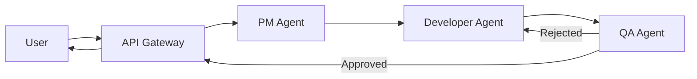
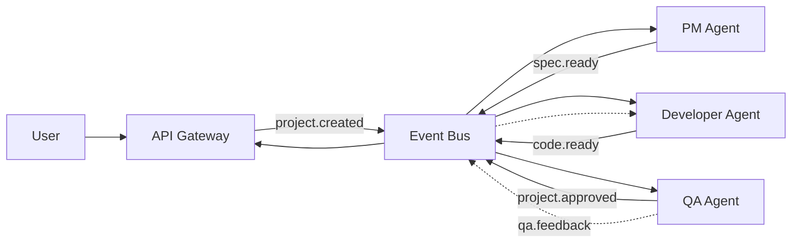
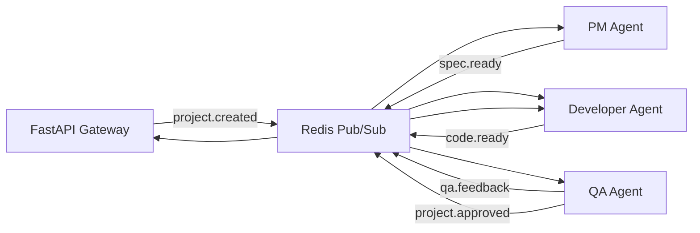
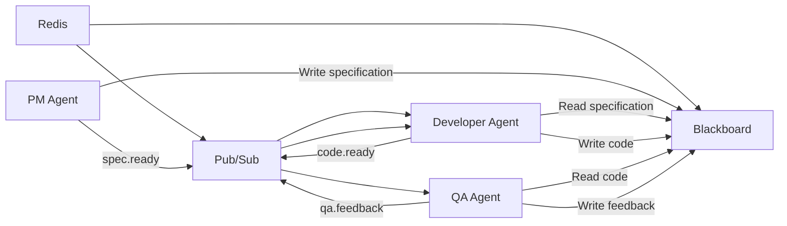
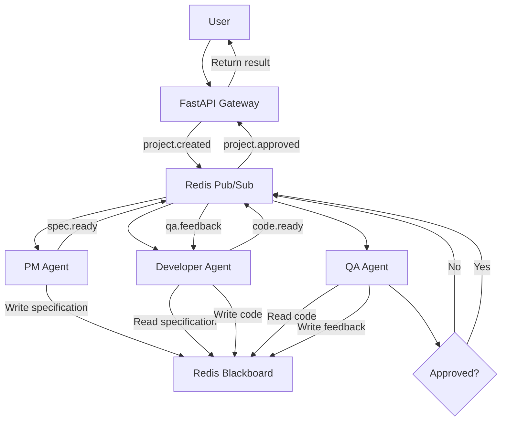
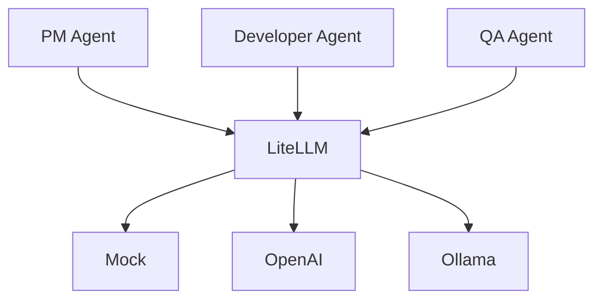
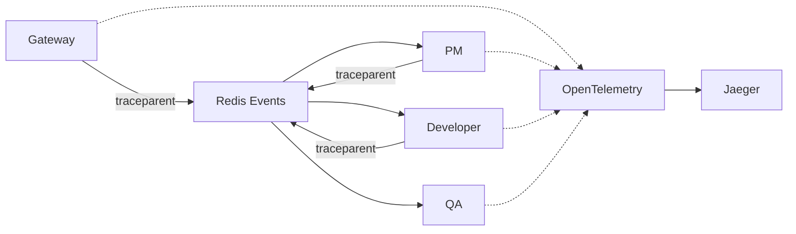
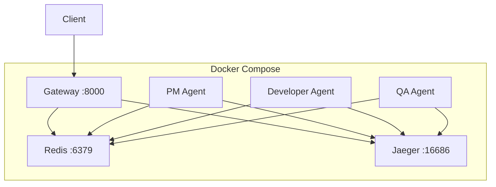
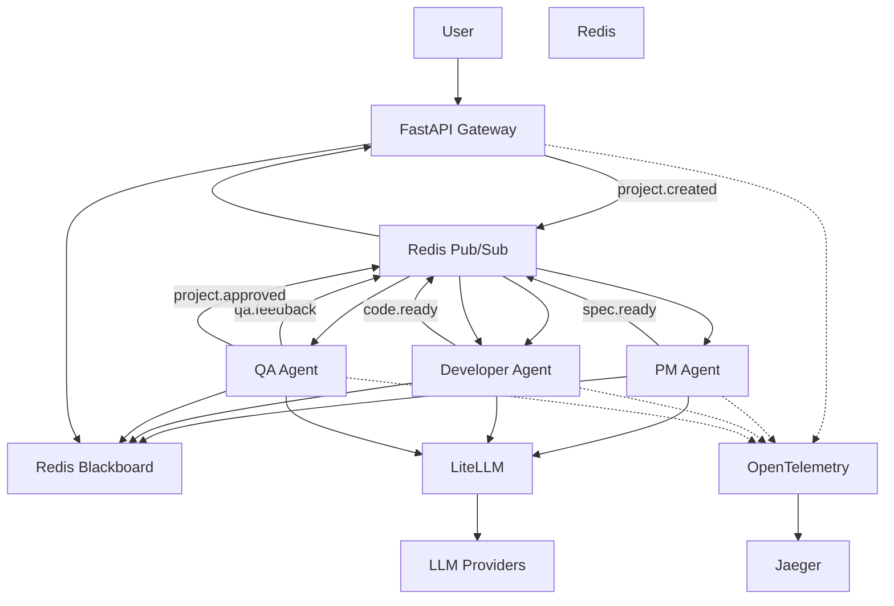

# Event-Driven Multi-Agent System Architecture

> A distributed, event-driven AI system where specialized agents collaborate asynchronously to transform a natural language project request into reviewed, production-ready code.

---

# Table of Contents

1. What We Built
2. The Simplest Architecture
3. Why Direct Agent Communication Doesn't Scale
4. Introducing Event-Driven Communication
5. Redis as the Event Bus
6. Redis as a Shared Blackboard
7. The Complete Agent Workflow
8. Where the LLM Fits
9. Distributed Tracing
10. Deployment Architecture
11. Complete System Architecture
12. Architectural Principles

---

# 1. What We Built

Instead of relying on a single AI agent to perform every task, this project breaks software development into a series of **specialized agents**, each responsible for one stage of the workflow.

The system behaves like a small engineering team.

| Agent | Responsibility |
|--------|---------------|
| **PM Agent** | Converts the user's request into a structured technical specification |
| **Developer Agent** | Implements the specification |
| **QA Agent** | Reviews the implementation and either approves it or requests another iteration |

The workflow is iterative.

If QA rejects the implementation, the feedback is sent back to the Developer Agent until the implementation satisfies the requirements.

Unlike traditional service-to-service architectures, these agents **never call each other directly**.

Instead, they communicate through an **event-driven architecture using Redis Pub/Sub**, while Redis simultaneously stores the project's shared state.

Project state is stored as:

```text
project:{id}:specs
project:{id}:code
project:{id}:feedback
```

Additional platform components include:

- FastAPI Gateway
- Redis Pub/Sub
- Redis Blackboard
- LiteLLM
- OpenTelemetry
- Jaeger
- Docker Compose

---

# 2. The Simplest Architecture

Ignoring infrastructure for a moment, the workflow is extremely straightforward.



Conceptually:

```text
User
 ↓
Gateway
 ↓
PM
 ↓
Developer
 ↓
QA
 ↓
 ├── Reject → Developer
 └── Approve → Gateway
```

This works logically.

But it introduces an architectural problem.

---

# 3. Why Direct Agent Communication Doesn't Scale

Suppose the PM Agent directly calls the Developer Agent.

```text
PM ─────────► Developer
```

Now PM must know:

- where Developer is running
- how to reach it
- whether it's healthy
- which API it exposes
- how retries work

Every new agent increases coupling.

This makes scaling and deployment much harder.

Instead, we want agents to communicate through **events**, not direct knowledge of one another.

---

# 4. Introducing Event-Driven Communication

Rather than calling another service directly, an agent simply publishes an event.

Instead of this:

```text
PM ─────────► Developer
```

we get:

```text
PM ─────────► Event Bus ─────────► Developer
```

Now PM only knows one thing:

> "I finished my work."

The Developer only knows:

> "A new specification is available."

The communication contract becomes the event itself.



This creates **loosely coupled workers**.

---

# 5. Redis as the Event Bus

The project uses **Redis Pub/Sub** as the event transport layer.

Each stage publishes a new event.



Each worker subscribes only to the topics it cares about.

Examples:

| Topic | Consumer |
|--------|----------|
| `project.created` | PM |
| `spec.ready` | Developer |
| `code.ready` | QA |
| `qa.feedback` | Developer |
| `project.approved` | Gateway |

Redis completely decouples the services.

---

# 6. Redis as a Shared Blackboard

Events tell us **that something happened**.

They don't hold the entire project state.

Instead, Redis also acts as a **shared blackboard**.

The PM Agent stores:

```text
project:123:specs
```

Then publishes:

```text
spec.ready
```

The Developer receives the event and loads the specification using the project ID.

This creates two independent responsibilities inside Redis.

```text
Redis
│
├── Pub/Sub
│     └── Event Transport
│
└── Blackboard
      └── Shared Project State
```

Architecture:



This separation keeps **events** and **state** independent.

---

# 7. The Complete Agent Workflow

Once both communication mechanisms exist, the full workflow emerges.



The workflow becomes:

1. User submits a project.
2. Gateway publishes `project.created`.
3. PM creates a specification.
4. Specification is stored.
5. Developer generates code.
6. Code is stored.
7. QA reviews it.
8. If rejected, Developer receives feedback.
9. If approved, Gateway returns the completed project.

---

# 8. Where the LLM Fits

The agents themselves aren't language models.

They're **orchestration workers**.

Each worker calls an LLM appropriate for its task.



LiteLLM allows providers to be swapped without changing agent logic.

---

# 9. Distributed Tracing

One project moves across multiple independent processes.

```text
Gateway
   │
   ▼
PM
   ▼
Developer
   ▼
QA
```

Without tracing, debugging becomes difficult.

The system propagates the **W3C trace context** through Redis events.



Every service contributes child spans to one distributed trace.

---

# 10. Deployment Architecture

Each component runs as an independent container.



This means each worker can scale independently.

---

# 11. Complete System Architecture

Now we can combine every concept into one architecture.



---

# 12. Architectural Principles

### Loose Coupling

Agents communicate through events rather than direct service calls.

### Asynchronous Execution

Every worker operates independently.

### Shared State

Redis provides a centralized project blackboard.

### Specialized Responsibilities

Each agent performs one clearly defined task.

### Iterative Development

QA can reject work and send it back for another implementation cycle.

### LLM Abstraction

LiteLLM keeps providers interchangeable.

### End-to-End Observability

OpenTelemetry and Jaeger provide visibility across distributed workers.

### Independent Deployment

Every service can be deployed and scaled independently.

---

# The Architectural Journey

The design evolved through a series of intentional decisions.

```text
Specialized Agents
        │
        ▼
Direct Calls Become Coupled
        │
        ▼
Introduce Events
        │
        ▼
Redis Pub/Sub
        │
        ▼
Need Shared State
        │
        ▼
Redis Blackboard
        │
        ▼
Pluggable LLM Layer
        │
        ▼
Distributed Tracing
        │
        ▼
Distributed Event-Driven Multi-Agent System
```

Instead of mixing orchestration, communication, storage, intelligence, and observability together, each concern has its own dedicated architectural layer. This separation makes the system easier to understand, easier to extend, and significantly easier to scale.


## Architecture highlights

- **Decoupled workers:** PM, Dev, and QA are independent Python services.
- **Redis coordination:** Pub/Sub carries work; `project:{id}:*` keys retain the
  latest specs, code, and QA feedback.
- **Distributed tracing:** W3C trace context travels inside each JSON event and
  is exported to Jaeger over OTLP.
- **Pluggable LLM:** `LLM_PROVIDER=mock` runs without credentials; `openai`
  uses LiteLLM; `ollama` targets a local Ollama server.
- **Local-first operations:** Docker Compose starts the whole environment with
  one command.

## Prerequisites

- Docker Engine with Docker Compose v2
- `curl`
- Optional: an OpenAI-compatible API key or a local Ollama installation

## Quickstart

```bash
cp .env.example .env
docker compose up --build -d
docker compose ps
```

The default mock provider makes the first request deterministic and does not
need an API key. Explore distributed traces at
<http://localhost:16686>.

## Submit a project

```bash
curl -sS -X POST http://localhost:8000/project \
  -H 'Content-Type: application/json' \
  -d '{"prompt":"Build a command line todo list in Python"}' | jq
```

The response includes a unique `project_id`, `status`, the generated Markdown
specification, the reviewed Python source, and QA feedback.

## Inspect the blackboard

```bash
PROJECT_ID="replace-with-project-id"
docker compose exec redis redis-cli GET "project:${PROJECT_ID}:specs"
docker compose exec redis redis-cli GET "project:${PROJECT_ID}:code"
docker compose exec redis redis-cli GET "project:${PROJECT_ID}:feedback"
```

## Run the smoke test

With the Compose stack running:

```bash
python scripts/test_simulation.py
```

The script submits a project, verifies generated state and approved QA
feedback, then checks the Jaeger API for a gateway trace.

## LLM providers

The default `.env.example` configuration is:

```dotenv
LLM_PROVIDER=mock
```

For OpenAI through LiteLLM, set `LLM_PROVIDER=openai`, `LLM_MODEL` to an
OpenAI model, and provide `OPENAI_API_KEY` in your local `.env`. For Ollama,
set `LLM_PROVIDER=ollama`, `LLM_MODEL=ollama/<model-name>`, and
`OLLAMA_API_BASE=http://host.docker.internal:11434`.

## Shutdown

```bash
docker compose down
```
